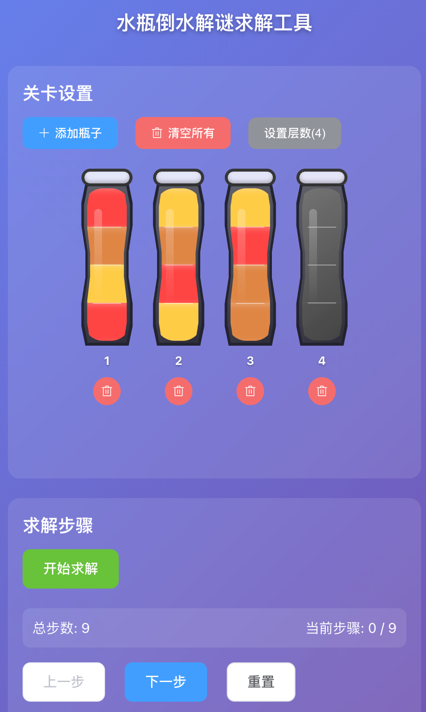

# 水瓶倒水解谜求解工具

一个基于 Vue 2.0 + Element UI 的水瓶倒水解谜游戏求解工具，支持移动端适配。

在线地址：[http://water-bottle-game.trojx.com](http://water-bottle-game.trojx.com)

相关游戏：
- [Liquid Sort Puzzle: Water Sort](https://play.google.com/store/apps/details?id=com.TumbGames.LiquidSortPuzzle&hl=zh)
- [倒水拼图: 颜色水排序益智游戏Water Sort](https://apps.apple.com/cn/app/%E5%80%92%E6%B0%B4%E6%8B%BC%E5%9B%BE-%E9%A2%9C%E8%89%B2%E6%B0%B4%E6%8E%92%E5%BA%8F-%E7%9B%8A%E6%99%BA%E6%B8%B8%E6%88%8F-water-sort/id6557070082)



## 功能特性

- 🎮 **关卡设置**：可以添加多个瓶子，点击瓶子的每一层设置水的颜色
- 🎨 **颜色选择**：支持12种颜色（红、橙、黄、绿、青、蓝、紫、粉、棕、灰、黑、白）
- 🔄 **拖拽排序**：可以拖拽瓶子调整顺序，贴近手机游戏中的布局
- 🤖 **智能求解**：使用A*算法自动求解最优解
- 📱 **移动端适配**：完美适配手机屏幕
- 📋 **步骤导航**：逐步显示求解步骤，支持前进、后退和跳转

## 游戏规则

1. 每个瓶子最多可以装4层水
2. 不同颜色的水会分层，互不融合
3. 相邻的相同颜色水可以融合
4. 倒水规则：
   - A向B倒水时，A瓶最上面一层（或多层相同颜色）的颜色必须与B瓶最上面一层水的颜色相同
   - B瓶不能溢出（空间不足时可以只倒一层）
   - B瓶为空时，A瓶可以将任何层数的同一种颜色的水倒入
5. 获胜条件：所有瓶子要么是空的，要么是装满相同颜色的水

## 安装和运行

```bash
# 安装依赖
npm install

# 开发模式运行
npm run serve

# 构建生产版本
npm run build
```

## 使用方法

1. **设置关卡**：
   - 点击"添加瓶子"按钮添加新瓶子
   - 点击瓶子的每一层，选择颜色
   - 可以拖拽瓶子调整顺序
   - 点击删除按钮移除不需要的瓶子

2. **求解**：
   - 设置好关卡后，点击"开始求解"按钮
   - 系统会自动计算最优解

3. **查看步骤**：
   - 求解完成后，会显示所有步骤
   - 点击"下一步"按钮逐步执行
   - 点击"上一步"可以回退
   - 点击步骤列表中的任意步骤可以跳转
   - 点击"重置"回到初始状态

## 技术栈

- Vue 2.6.14
- Vue Router 3.5.1
- Vuex 3.6.2
- Element UI 2.15.13
- VueDraggable 2.24.3

## 项目结构

```
WaterBottleGame/
├── public/              # 静态资源
├── src/
│   ├── components/      # 组件
│   │   ├── WaterBottle.vue    # 瓶子组件
│   │   └── ColorPicker.vue     # 颜色选择器
│   ├── views/           # 视图
│   │   └── GameSolver.vue     # 主页面
│   ├── store/           # Vuex状态管理
│   │   └── modules/
│   │       └── game.js        # 游戏状态
│   ├── utils/           # 工具函数
│   │   └── solver.js          # 求解算法
│   ├── styles/          # 样式文件
│   │   └── main.scss          # 主样式
│   ├── App.vue          # 根组件
│   └── main.js          # 入口文件
├── package.json
└── README.md
```

## 算法说明

使用广度优先搜索（BFS）算法求解最优解：
- 从初始状态开始，尝试所有可能的倒水操作
- 使用状态去重避免重复搜索
- 找到第一个解即为最优解（BFS保证最短路径）
- 限制最大搜索深度为50步，避免无限搜索

## 浏览器支持

- Chrome（推荐）
- Firefox
- Safari
- Edge
- 移动端浏览器（iOS Safari、Chrome Mobile等）

## 许可证

MIT License

